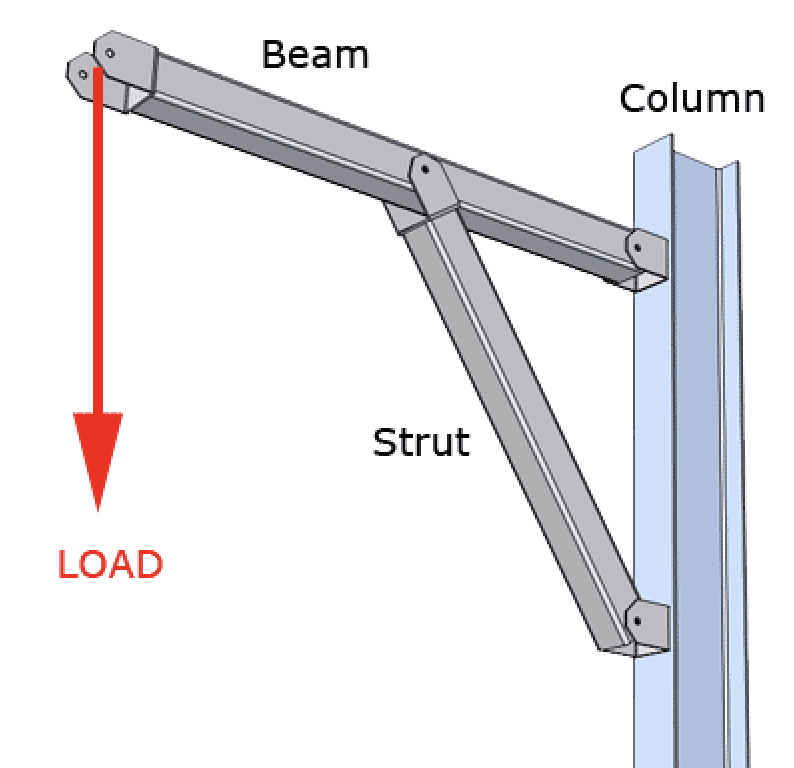
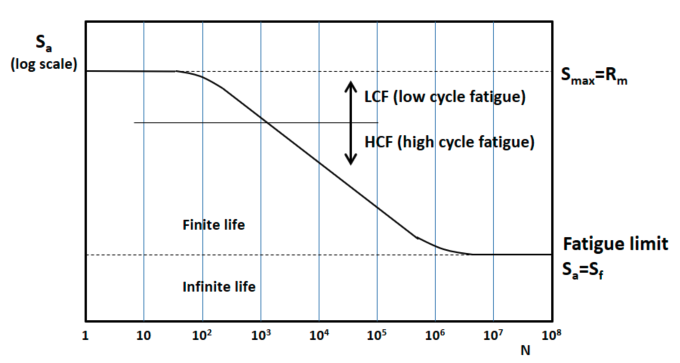

<!-- You have some errors, warnings, or alerts. If you are using reckless mode, turn it off to see inline alerts.
* ERRORs: 0
* WARNINGs: 0
* ALERTS: 1 -->

# Mechanical Engineering Fundamentals

Review of terms

Table of contents:

- [Mechanical Engineering Fundamentals](#mechanical-engineering-fundamentals)
  - [Structures](#structures)
    - [Strut](#strut)
  - [Fasteners](#fasteners)
    - [SHCS](#shcs)
    - [Micro D Jackpost](#micro-d-jackpost)
    - [Micro D Jackscrew](#micro-d-jackscrew)
    - [Types of threadlockers](#types-of-threadlockers)
    - [Dial indicator torque wrench](#dial-indicator-torque-wrench)
  - [Fatigue](#fatigue)
    - [Fatigue](#fatigue-1)
    - [S-N Curve](#s-n-curve)
    - [Infinite life](#infinite-life)
    - [Notch](#notch)
    - [Kt](#kt)
  - [Resources](#resources)

## Structures

  ### Strut
  * Structural component that resists compression
  
   

## Fasteners

### SHCS

* Socket head cap screw

### Micro D Jackpost

* The fastener on the female side of the connector

### Micro D Jackscrew

* The screw that goes into the jackpost when mating connectors

### Types of threadlockers

* Inert: No chemical reaction takes place. The prevailing torque keeps it in place
    * Can also be adjusted after the fact
* Reactive: Chemical reaction takes place during installation
    * Sometimes the chemical reaction creates an

### Dial indicator torque wrench

* A type of torque wrench that has a dial on main pointer to display the amount of torque applied when turning

## Fatigue

### Fatigue

* One of the most common failure mechanisms in engineering structures
* It has a statistical nature

### S-N Curve

* A way to describe the fatigue properties of materials: describes the relation between cyclic stress amplitude and the number of cycles to a failure
* Horizontal axis: Number of cycles to failure on a log scale (N)
* Vertical axis (either linear or log): The stress amplitude - the maximum stress of a cycle (Sa)
* They’re derived empirically
* Aka. the fatigue limit, fatigue curve, Wöhler curve
* Example curve:

    

### Infinite life

* Sometimes a test is stopped after an incredibly large (i.e. N > 106), and this is interpreted as infinite life of the material
* More common for metals than plastics
* Denoted as Sf

### Notch

* A deliberately induced v-shape, u-shape, or circle which causes a stress concentration
* This allows for fatigue cracks to start and grow more easily
* Notched specimens will break via fatigue before unnotched specimens. Thus it’s important to make this distinction when running tests
    * This is because stress concentration at the notch causes a stress gradient

### Kt

* If a fatigue curve specimen is notched or not. 
* Kt = 1 means unnotched
* Kt > 1 = notched

## Resources
