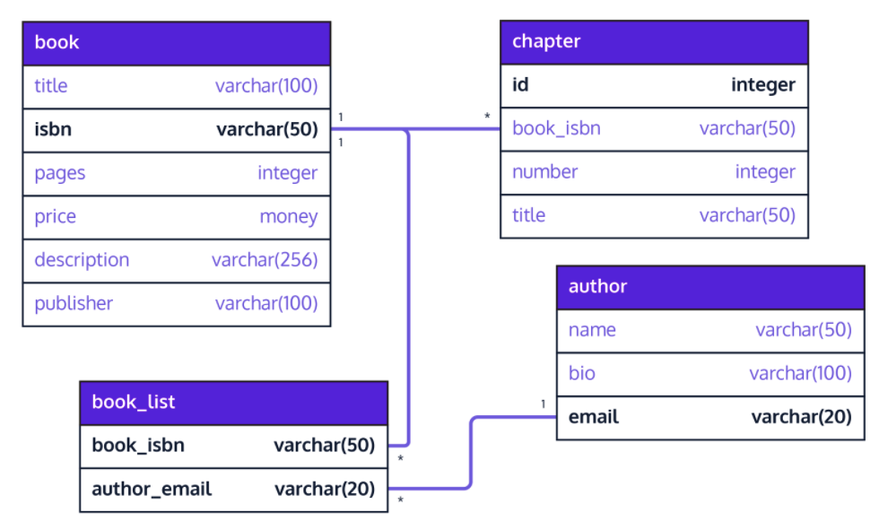
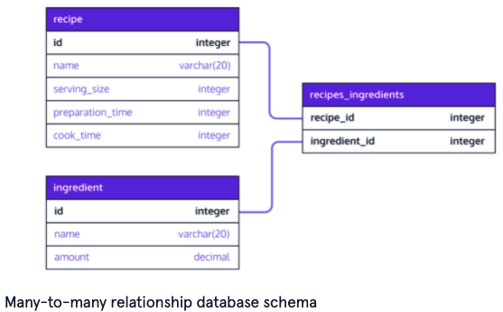

# Relational Databases

- [Database](#database)
- [Database vs spreadsheet](#database-vs-spreadsheet)
- [Database management system (DBMS)](#database-management-system-dbms)
- [Records](#records)
- [Columns](#columns)
- [Relational database](#relational-database)
- [Relational database management system (RDBMS)](#relational-database-management-system-rdbms)
- [Relational database structure](#relational-database-structure)
- [Commitment](#commitment)
- [ACID](#acid)
- [Relational database rules](#relational-database-rules)
- [Locking](#locking)
- [SQL](#sql)
- [Key](#key)
- [Primary key](#primary-key)
- [Composite primary key](#composite-primary-key)
- [Relationships](#relationships)
- [Stored procedures](#stored-procedures)
- [Unstructured data](#unstructured-data)
- [MySQL](#mysql)
- [PostgreSQL](#postgresql)
- [SQLite](#sqlite)
- [Benefits of using a dedicated database server](#benefits-of-using-a-dedicated-database-server)
- [OracleDB](#oracledb)
- [SQL Server](#sql-server)
- [NoSQL](#nosql)
- [Considerations when selecting a database](#considerations-when-selecting-a-database)
- [SQL vs. NoSQL databases](#sql-vs-nosql-databases)
- [Autonomous database](#autonomous-database)
- [Database schema](#database-schema)
- [To consider when designing a database](#to-consider-when-designing-a-database)
- [Popular database schema design software](#popular-database-schema-design-software)
- [Information schema](#information-schema)
- [Separating out into multiple tables](#separating-out-into-multiple-tables)
- [How Postgres works](#how-postgres-works)
- [Postbird](#postbird)
- [PgAdmin](#pgadmin)
- [psql](#psql)
- [Clause](#clause)
- [Statement](#statement)
- [Common data types](#common-data-types)
- [Additional Postgres data types](#additional-postgres-data-types)
- [Constraints](#constraints)
- [Result set](#result-set)
  - [CREATE TABLE](#create-table)
  - [ALTER TABLE](#alter-table)
  - [INSERT INTO](#insert-into)
  - [SELECT](#select)
  - [WHERE](#where)
  - [AS](#as)
  - [SELECT DISTINCT](#select-distinct)
  - [ORDER BY](#order-by)
  - [UPDATE](#update)
  - [DELETE FROM](#delete-from)
  - [LIMIT](#limit)
  - [CASE...WHEN](#casewhen)
- [Postgres Clauses](#postgres-clauses)
  - [UNNEST](#unnest)
- [Arithmetic Operators](#arithmetic-operators)
  - [LIKE](#like)
  - [BETWEEN](#between)
  - [AND](#and)
  - [OR](#or)
  - [IS NULL](#is-null)
- [Aggregates](#aggregates-1)
  - [COUNT()](#count)
  - [SUM()](#sum)
  - [MAX() and MIN()](#max-and-min)
  - [AVG()](#avg)
  - [ROUND()](#round)
  - [GROUP BY](#group-by)
  - [HAVING](#having)
- [Column references](#column-references)
- [Joining](#joining)
- [Foreign key](#foreign-key)
- [One to one database relationships](#one-to-one-database-relationships)
- [One to many database relationships](#one-to-many-database-relationships)
- [Many to many database relationships](#many-to-many-database-relationships)
- [Join table](#join-table)
  - [JOIN](#join)
  - [INNER JOIN](#inner-join)
  - [LEFT JOIN](#left-join)
  - [CROSS JOIN](#cross-join)
  - [UNION](#union)
  - [WITH](#with)
  - [REFERENCES](#references)
  - [SELECT among multiple tables](#select-among-multiple-tables)
  - [UNIQUE](#unique)


# General Terminology


## Database


* A set of data (structured information) that’s stored on a computer
* It’s usually structured in a way that makes data easily accessible


## Database vs spreadsheet


* Who can access the data: 
    * Spreadsheets are made for one user or a small group of users. Incredibly complicated manipulation isn’t often required
    * Databases allow massive amounts of users to access data quickly and securely at the same time
* How the data is stored: 
    * Spreadsheets: simple organization, usually with few or no relationships between records
    * Databases allow complex organization
* How much data can be stored	


## Database management system (DBMS)


* A program that serves as an interface between the database and the programs that use it (users)
* It allows users to retrieve info, update info, and manage how it’s stored and organized
* It also handles monitoring, tuning, and backup + recovery
* Often the data, DBMS, and associated applications are just known as the database
* Popular DBMS’s: MySQL, SQLite, PostgreSQL, Microsoft Access, Microsoft SQL Server, FileMaker Pro, Oracle Database, and dBase


## Records


* The rows of data
* Tables can have millions + records of data


## Columns


* Hold attributes of the data
* Each record usually has a value for each attribute. Data types are often specified


## Relational database


* A type of database in which data can be identified and accessed in relation to another piece of data in the database
* Data in relational databases is usually organized into tables
* Each record has a unique ID called the key
* Different tables might have a same column in common - i.e. the customer id. Because of that common column, the database creates a relationship between the two tables
* They excel at data consistency across applications and copies of the database. They ensure multiple instances of the same database always have the same data
* Have been around since the 1970’s


## Relational database management system (RDBMS)


* Provides the ability to create, update, and administer a relational database
* Most RDBMS’s use SQL to access the database


## Relational database structure


* In the relational model the tables, views, and indexes are separate from physical storage structures
* This separation allows actions like renaming a database without renaming the tables stored within it


## Commitment


* Making a permanent change to the database


## ACID


* Four essential properties of relational database transactions
    * Atomicity: A series of database transactions in which either all occur or none are allowed to occur
    * Consistency: rules to keep data in the correct state after a transaction
    * Isolation: Keeps the effect of a transaction invisible to other transactions until it’s committed. This helps avoid confusion
    * Durability: Makes sure changes are permanent after commitment


## Relational database rules


* Usually there are specific integrity roles - like no duplicate rows
* Granular business rules can also be implemented to enforce atomicity. For example an inventory database with three parts always used together. I.e. it won’t let a checkout for one be committed if inventory of another part is out.
* Concurrency rules: control policies for users/applications calling queries at the same time on the same database


## Locking


* The prevention of other users/apps from accessing data while it’s being updated
* In some databases the whole table is locked (hurts performance) while in others just the record is locked.


## SQL


* Programming language to communicate with data stored in an RDBMS
* It’s similar to english - easy to read and learn
* It’s based on relational algebra - is internally consistent. This helps for performance.


## Key


* A column or group of columns in a relational db table that uniquely identifies a row in a table
* They allow for constraints on the data in a table to enforce integrity. This includes:
    * Avoiding duplicity
    * Maintain relationships between tables
* Many types of keys, including (_italics_ most common): Super, Candidate, _Primary_, _Foreign_, _Composite_, and _Secondary_


## Primary key


* Uniquely identify each row. Duplicate primary keys will throw an error
* Can apply to a column or multiple columns
* Ensures that the column data is unique and not null
* Examples: SSN in an employee table


## Composite primary key


* Designate multiple columns to serve as the primary key
* Example: Since multiple states can have the same city name, set state and city name as both primary keys


## Relationships


* The way connected tables (in the schema) are dependent on one another


## Stored procedures


* Data access functions for repeated database operations that can be accessed with a simple application call
* This allows developers to not have to rewrite the functions themselves in each new application


## Unstructured data


* Data that doesn’t lend itself to table-style formatting used in relational databases
* MongoDB says 80-90% of data generated + collected now is unstructured


## MySQL


* The most popular open source SQL database
* Popular in web development. Was often used with php
* Advantages: easy to use, cheap, and a large community
* Disadvantages: poor performance when scaling, open source development has fallen behind since Oracle took control of it, and lacks some advanced features


## PostgreSQL


* Open source SQL database that’s independent of any corporation
* Advantages: same as MySQL
* Disadvantages: Slower than MySQL and less popular 
* Denoted by `.sql` files
* Still used in industry - Apple, Instagram, Twitch, and Reddit use it


## SQLite


* Popular open source SQL database. Stores the whole database in a file, allowing for local storage without connection to a server
* Popular for cell phones and other small electronics
* Denoted by `.sqlite` files


## Benefits of using a dedicated database server


* Better organization of database information
* More efficient storage
* Faster retrieval


## OracleDB


* Closed source database used for large applications. Is popular in banking
* It’s expensive


## SQL Server


* Closed source database owned by Microsoft
* Commonly used by large enterprises
* An entry level version called Express is free. Scaling it can become very expensive


## NoSQL


* Not only SQL - they are non-relational databases
* Don’t require predefined schemas
* Format can be:
    * Document-based (JSON)
    * Graph databases
    * Key-value pairs
    * Wide-column stores
    * Objects - as in object oriented programming
* All databases fall within the format of SQL or NoSQL databases


## Considerations when selecting a database


* Data accuracy:
    * How accurate do we want?
    * Are there regulatory requirements on the accuracy? (i.e. for financial data)
    * Does data storage/accuracy depend on business logic?
* Scalability
    * What is the current scale?
    * What is the anticipated growth?
    * Are multiple mirrored database copies (instances) required? If so, how accurate does data need to be across them?
* Concurrency
    * How important is it?
    * Will multiple users/apps need access at the same time?
    * Does the database management system need to support concurrency while also protecting the data?
* Performance and reliability needs
    * Is high performance/high uptime required
    * Requirements for query response performance?
    * What is the plan for unplanned downtime?


## SQL vs. NoSQL databases


* Advantages of SQL
    * The best at maintaining timely consistency with large amounts of data. NoSQL databases can only supply eventual consistency - when the database is scaled or multiple users are accessing at the same time, data needs time to catch up
        * Note: for some applications it’s ok to have eventual consistency. I.e. listings in a product catalog or on social media. However for critical business operations like cart checkouts, you need timely consistency.


## Autonomous database


* A new type of database that keeps the power and security of a relational database while using AI to improve query performance
    * Example: running hypotheses and tests on indices, then pushing thes best ones into production. This can make queries faster without human intervention
* Allows for starting a database much quicker. It can scale up on its own later
* Saves developers from the boring and non-innovative tasks of managing the database
* Also known as self-driving databases


# Database Design


## Database schema


* An architectural blueprint for the database
* Provides
    * Overview of the purpose of the database
    * Data that makes up the database (tables and columns)
    * How the data is organized into tables
    * How the tables relate to one another
* Should contain:
    * Table names
    * Column names and types for each table
    * Constraints per table (if applicable)
    * Relationships between tables (if applicable)
        * Foreign keys
        * Primary keys
* Example for a book inventory database:
    * Note: 1 and * denote a one to many relationship





## To consider when designing a database


* What is its purpose
* What information makes it?
* How to organize the information into tables?
* Avoid redundant data - it wastes space and can lead to mismatches
* Identify and implement relationships between tables


## Popular database schema design software


* [DbDiagram.io](https://dbdiagram.io/home) - a free, simple tool to draw ER diagrams by just writing code, designed for developers and data analysts
* [SQLDBM](http://sqldbm.com/home) - SQL Database Modeler
* [DB Designer](http://dbdesigner.net/) - online database schema design and modeling tool


## Information schema


* A read only database that has meta information about objects in the databases. This info includes tables, columns, and constraints
* Note that constraint names (i.e. `constraint_name` in the below queries) is generated by default
    * `pkey` = primary key constraint
    * `fkey` = foreign key constraint
* Postgres example: view all constraints among all tables in a database:

    ```
    SELECT
     constraint_name, table_name, column_name
    FROM
     information_schema.key_column_usage
    ```


* Postgres example: view all constraints in a table:

    ```
    SELECT
     constraint_name, table_name, column_name
    FROM
     information_schema.key_column_usage
    WHERE
     table_name = 'recipe';

    ```


## Separating out into multiple tables


* If you have a scenario where you want to maintain additional optional information, but it won’t be included with every book, consider breaking this info into another table
* Otherwise, you’ll have a lot of empty/null records in your big table which can get messy
* Example: Additional book info such as book rating, language, tag, and date of publication. If you put all this in the main `books` table, you might wind up with a lot of empty columns


# Postgres

Note: See [Node-SQLite](https://quinncoyle.com/notes/node-sqlite/) to use an sqlite database locally


## How Postgres works


* It’s a database server
* A variety of clients can connect to it, including a GUI Client, CLI Client, and Programming Language Client (usually via an ORM)
* To run it locally, both a Postgres server and client need to be set up. See Codecademy for [details](https://www.codecademy.com/paths/design-databases-with-postgresql/tracks/what-is-a-database/modules/using-postgresql-on-your-own-computer/articles/installing-and-using-postgresql-locally)


## Postbird


* A simple GUI for Postgres database manipulation
* Is open source


## PgAdmin


* Another good open source GUI for Postgres


## psql


* Standard CLI for interacting with a Postgres database
* Used in industry and by hobbyists
* Queries can be typed into the command line or via a file
* Clicking on a database in the Postgress app for mac automatically opens the terminal with psql


# SQL Clauses


## Clause


* A specific SQL command (i.e. `CREATE TABLE`)


## Statement


* Text that the database recognizes as a valid command
* Statements always end in semicolons
* Components of a statement:
    * Clause
    * Table name: name of the table the command is applied to
    * Parameter: list of columns, data types, or values (i.e. if inserting into) passed into the clause as an argument
* Example:

    ```
    CREATE TABLE table_name (
      column_1 data_type,
      column_2 data_type,
      column_3 data_type
    );

    ```


## Common data types


* `integer`
* `text`: a text string with an unlimited length
* `date`: YYYY-MM-DD
* `real`: a decimal value


## Additional Postgres data types


* `decimal`: floating-point number i.e. `26.17345`
* `money`: floating-point number with two decimal places. I.e. `6.17`
* `boolean`: `TRUE` or `FALSE`
* `char(n)`: fixed length string. Trailing blanks get automatically removed.
    * I.e. `'123 '` becomes `'123`’
* `varchar(n)`: variable-length string that does not remove trailing blanks


## Constraints


* Specify additional information for how a column can be used after invoking the data type when creating or altering a table
* The database will reject inserted data that doesn’t adhere to those constraints
* A few examples:
    * `PRIMARY KEY`: Recall a table can only have one of them. Can be multiple columns
    * `PRIMARY KEY (column_one, column_two)`: Create a composite primary key. Designate multiple columns as the primary key
    * `UNIQUE`: Must have a different value for every row
        * A table can have many different `UNIQUE` columns
    * `NOT NULL`
        * Must have a value; inserting without a value for that column will throw an error and the row won’t be inserted
    * `DEFAULT`
        * Takes in an additional argument that will be the value inserted unless otherwise given

    ```
    CREATE TABLE celebs (
      id integer PRIMARY KEY,
      name text UNIQUE,
      date_of_birth text NOT NULL,
      date_of_death text DEFAULT 'Not Applicable'
    );

    ```


## Result set


* A new table that’s always returned by a `SELECT` statement based on what is queried


### CREATE TABLE


* Example:

    ```
    CREATE TABLE celebs (
     first_name varchar(15),
     last_name varchar(15),
     age integer,
     ssn char(9)
    );

    ```


### ALTER TABLE


* Adds a new column to a able
* Follow it with the `ADD COLUMN` clause
* Rows in the table that existed before adding this column will get a `NULL` value
* Examples:

    ```
    ALTER TABLE celebs
    ADD COLUMN twitter_handle TEXT;

    ALTER TABLE chapter
    DROP COLUMN content

    ```


### INSERT INTO


* Statement to add rows to a table
* Example with columns specified:

    ```
    INSERT INTO celebs (id, name, age)
    VALUES (1, 'Justin Bieber', 22);
    ```


* Example without columns specified:

    ```
    INSERT INTO celebs
    VALUES (1, 'Justin Bieber', 22);
    ```


* Example with multiple rows:

    ```
    INSERT INTO celebs
    VALUES
       (1, 'Justin Bieber', 22),
       (1, 'Lady Gaga', 30);

    ```


### SELECT


* Fetch data from a database
* By specific column(s): `SELECT name FROM celebs;`
* Get all columns: `SELECT * FROM celebs;`


### WHERE


* Filters the result set to only return rows where the condition following `WHERE` is true

    ```
    SELECT *
    FROM movies
    WHERE imdb_rating > 8;

    ```


### AS


* Allows you to rename a column as an alias
* It’s best practice to surround your alias with single quotes
* Note: AS is not renaming the columns in the table, only in the result set
* Example:

    ```
    SELECT name AS 'Titles'
    FROM movies;

    ```


### SELECT DISTINCT


* Return unique rows in the `SELECT` output

    ```
    SELECT DISTINCT tools
    FROM inventory;

    ```


### ORDER BY


* Sort results alphabetically or numerically
* Goes after WHERE
* Ascending is `ASC`, descending is `DESC`
* Example for descending:

    ```
    SELECT *
    FROM movies
    WHERE imdb_rating > 8
    ORDER BY year DESC;

    ```


### UPDATE


* Edit an existing row in a table
* Follow it with the `SET` clause to add the row value
* Example:

    ```
    UPDATE celebs
    SET twitter_handle = '@taylorswift13'
    WHERE id = 4;

    ```


### DELETE FROM


* Deletes one or more existing rows from a table
* Example: delete all rows

    ```
    DELETE FROM celebs
    ```


* Example: delete all rows based on condition:

    ```
    DELETE FROM celebs
    WHERE twitter_handle IS NULL;

    ```


### LIMIT


* Cap the number of rows in a result to save space and make queries faster
* It always goes at the end of the query
* Note that it’s not supported by some databases

    ```
    SELECT *
    FROM movies
    LIMIT 10;

    ```


### CASE...WHEN


* The way to handle if-then logic in SQL
* `WHEN` tests the condition
* `THEN` and `ELSE` gives a value depending on the conditions
* `END` is required to end
    * Usually, use `END AS 'your_column_name'` Otherwise, the query will be put in the column name
* Example

    ```
    SELECT name,
    CASE
     WHEN imdb_rating > 8 THEN 'Fantastic'
     WHEN imdb_rating > 6 THEN 'Poorly Received'
     ELSE 'Avoid at All Costs'
    END AS 'Review'
    FROM movies;

    ```

## Postgres Clauses
### UNNEST
* Takes an array returned in a table and returns more rows for everything inside the array
  * `SELECT UNNEST(ia._multiselect_values)` --> `{}` into two rows of `Other`, `(PCBA) Incorrect placement`


# `WHERE` Operators


## Arithmetic Operators


* =, !=, >, &lt;, &lt;=, and >= can be used


### LIKE


* Searches for a specific pattern
* Note that `LIKE` is not case sensitive
* Examples:
    * `name LIKE 'Se_en'` is a wildcard where any value for the `_` matches the pattern
    * `name LIKE '%Se_en%'` is another wildcard that matches values including the pattern (i.e. name=Furious Seven will also be returned)
    * `name LIKE 'A%'` matches any names that begin with the letter `A`


### BETWEEN


    * Filter the result set within a certain range
    * Accepts numbers, text, or dates
        * Note that it goes up to the second value but not after it. So a movie named “J” in the second query would match, but not “Jaws”

    ```
    SELECT *
    FROM movies
    WHERE year BETWEEN 1990 AND 1999;

    SELECT *
    FROM movies
    WHERE name BETWEEN 'A' AND 'J';

    ```


### AND


    * Used to combine multiple conditions

    ```
    SELECT *
    FROM movies
    WHERE year BETWEEN 1990 AND 1999
      AND genre = 'romance';

    ```


### OR


* Displays a row if any condition is true

    ```
    SELECT *
    FROM movies
    WHERE year > 2014
      OR genre = 'action';

    ```


### IS NULL


* Condition that returns true if a value is `NULL` and false otherwise
* `IS NOT NULL` can also be used


# Aggregates


## Aggregates


* Calculations done on multiple rows of a table


### COUNT()


* Calculate the number of rows in a table or result set
* All rows:

    ```
    SELECT COUNT(*)
    FROM fake_apps;
    ```


* By condition:

    ```
    SELECT COUNT(*)
    FROM fake_apps
    WHERE price = 0;

    ```


### SUM()


* Add all values in a column

    ```
    SELECT SUM(downloads)
    FROM fake_apps;

    ```


### MAX() and MIN()


* Return the highest and lowest values in a column, respectively

    ```
    SELECT MAX(downloads)
    FROM fake_apps;

    ```


### AVG()


* Calculate the average value for a column

    ```
    SELECT AVG(price)
    FROM fake_apps;

    ```


### ROUND()


* Takes in two arguments: the column and an integer (for # of decimal places)

    ```
    SELECT ROUND(price, 0)
    FROM fake_apps;
    ```


* Note that you can also put other argument inside this, i.e.

    ```
    SELECT ROUND(AVG(price), 2)
    FROM fake_apps;

    ```


### GROUP BY


* A SQL clause used with aggregate functions to group rows that have the same values into summary rows
* Comes after WHERE but before any ORDER BY
* Commonly used with COUNT to get the number of rows matching the criteria of a column:

    ```
    SELECT price, COUNT(*)
    FROM fake_apps
    GROUP BY price;
    ```


    Returns:


    ```
    price   COUNT(*)
    0.0     73
    0.99    43
    1.99    42
    2.99    21
    3.99    9
    14.99   12
    ```


* Example for the number of downloads by category:

    ```
    SELECT category, SUM(downloads)
    FROM fake_apps
    GROUP BY category;

    ```


	Returns:


```
    category    SUM(downloads)
    Books           160864
    Business        178726
    Catalogs        186158
    Education       184724
    Entertainment   95168

```


* You can also use group by for multiple columns to get more granular:

    ```
    SELECT category,
     price,
     AVG(downloads)
    FROM fake_apps
    GROUP BY category, price;

    ```


### HAVING


* A way to filter groups (as opposed to filtering rows, which is what `WHERE` does) based on an aggregate property
* Comes after `GROUP BY` but before `ORDER BY`
* Note: you can have `WHERE` clauses in statements that also have `HAVING`. The `WHERE` comes before
* The below query filters out results where the # of apps is &lt; 10:

    ```
    SELECT price,
      COUNT(*)
    FROM fake_apps
    GROUP BY price
    HAVING COUNT(*) > 10;
    ```


    Returns:


    ```
    price   COUNT(*)
    0.0     73
    0.99    43
    1.99    42
    2.99    21
    14.99   12
    ```


    Whereas


    ```
    SELECT price,
      COUNT(*)
    FROM fake_apps
    GROUP BY price
    -- HAVING COUNT(*) > 10;
    ```


    Returns:


    ```
    price   COUNT(*)
    0.0     73
    0.99    43
    1.99    42
    2.99    21
    3.99    9
    14.99   12

    ```


## Column references


* When doing operations on calculations done on a column, 1, 2, 3, … can be used to refer to the nth column selected. The below two queries are equivalent. The second one saves time and is easier to read:

    ```
    SELECT ROUND(imdb_rating),
     COUNT(name)
    FROM movies
    GROUP BY ROUND(imdb_rating)
    ORDER BY ROUND(imdb_rating);
    ```


    With column references:


    ```
    SELECT ROUND(imdb_rating),
     COUNT(name)
    FROM movies
    GROUP BY 1
    ORDER BY 1;

    ```


# Working with Multiple Tables


## Joining


* Combining different tables based on matching parameters to understand a bigger system


## Foreign key


* A key that references a column in another table. For instance, when the primary key for one table appears in a different table
* The most common types of joins are joining a foreign key from one table to the primary key of another. This also has performance benefits with indexing
* Example: To create a record in the `emails` table, there must be a record in the `people` table. However there need not be a record in the `emails` table when creating a new `people` record


## One to one database relationships


* A row of table A is associated with exactly one row of table B, and vice versa
* Example: One person can have only one drivers licence ID assigned to them, and vice versa


## One to many database relationships


* Analogous to a parent-child relationship where a parent can have multiple children. A parent table houses a primary key and the child table houses both primary and foreign keys, with the foreign key binding the child to the parent
* Example: A `person` table and an `email` table. One person can have many emails


## Many to many database relationships


* When multiple records in one table are associated with multiple records in another table
* They can be broken down into two one-to-many relationships
* To implement them, we create a third cross-referencing table called a join table
* Example: a recipe can have many ingredients and a single ingredient belongs in many different recipes


## Join table


* A table to cross reference two many-to-many tables
* Has:
    * Foreign keys referencing the primary keys of the two member tables
    * A composite primary key consisting of the two foreign keys above
* Aka a cross reference table
* After creating a join table, you can add records to it to establish necessary relationships
* Schema example:





* Example of creating a join table from the above schema

    ```
    CREATE TABLE recipies_ingredients (
    recipie_id integer REFERENCES recipe(id),
    ingredient_id integer REFERENCES ingredient(id),
    PRIMARY KEY (recipie_id, ingredient_id)
    );

    ```


	The information schema will then look like:


```
    SELECT
    constraint_name, table_name, column_name
    FROM
    information_schema.key_column_usage
```


	


```
constraint_name                         table_name              column_name
recipie_pkey                            recipe                  id
ingredient_pkey                         ingredient              id
recipies_ingredients_pkey               recipies_ingredients    recipie_id
recipies_ingredients_pkey               recipies_ingredients    ingredient_id
recipies_ingredients_recipie_id_fkey    recipies_ingredients    recipie_id
recipies_ingredients_ingredient_id_fkey recipies_ingredients    ingredient_id
```


	


### JOIN


* Specify what tables to combine and how to do it
* Because column names can be repeated across tables, use` table_name.column_name` to be specific
* Example:

    ```
    SELECT *
    FROM orders
    JOIN subscriptions
     ON orders.subscription_id = subscriptions.subscription_id
    WHERE subscriptions.description = 'Fashion Magazine';

    ```


### INNER JOIN


* Same thing as a `JOIN`
* It results only in rows that match the `ON` condition


### LEFT JOIN


* Combines tables while keeping the unmatched rows from the first table

    ```
    SELECT *
    FROM newspaper
    LEFT JOIN online
     ON newspaper.subscriber_id = online.subscriber_id;
    ```


* Can be combined with WHERE NULL to filter out where there aren’t any matches:

    ```
    SELECT *
    FROM newspaper
    LEFT JOIN online
     ON newspaper.subscriber_id = online.subscriber_id
    WHERE online.subscriber_id IS NULL;

    ```


### CROSS JOIN


* Simply combine all rows of one table with rows of another table
* You don’t need an `ON` statement because you aren’t really joining on anything
* You can cross join as many tables as you want
* For example, see all possible combinations of shirts (table has 3 rows) and pants (table has 2 rows):

    ```
    SELECT shirts.shirt_color,
      pants.pants_color
    FROM shirts
    CROSS JOIN pants;
    ```


    Returns:


    ```
    shirt_color pants_color
    white       light denim
    white       black
    grey        light denim
    grey        black
    olive       light denim
    olive       black

    ```


### UNION


* Combine two tables if they satisfy the following requirements:	
    1. Same number of columns
    2. Same data types in the same order


### WITH


* Join the results of a separate query (instead of a table) with another table using an alias
* Remember not to include a `;` inside of the width statement

    ```
    WITH previous_query AS (
      SELECT customer_id,
      COUNT(subscription_id) AS 'subscriptions'
      FROM orders
      GROUP BY customer_id
    )
    SELECT customers.customer_name, previous_query.subscriptions
    FROM previous_query
    JOIN customers
     ON previous_query.customer_id = customers.customer_id

    ```


### REFERENCES


* Used to create a foreign key among other tables
* This ensures that you can correctly join the tables in a query
* Data types need to be the same among both tables
* Postgres example:

    ```
    CREATE TABLE person (
     id integer PRIMARY KEY,
     name varchar(20),
     age integer
    );
    CREATE TABLE email (
     email varchar(20) PRIMARY KEY,
     person_id integer REFERENCES person(id),
     storage integer,
     price money
    );
    ```


* Note: When querying the `information_schema`, this now looks like:

    ```
    SELECT
    constraint_name, table_name, column_name
    FROM
    information_schema.key_column_usage

    constraint_name          table_name  column_name
    book_pkey                   book        isbn
    chapter_book_isbn_fkey     chapter    book_isbn
    chapter_pkey               chapter       id

    ```


### SELECT among multiple tables


* You can return a table of columns from multiple tables:

    ```
    SELECT book.title AS book, chapter.title AS chapters
    FROM book, chapter
    WHERE book.isbn = chapter.book_isbn;
    ```


* Note: without the `WHERE` clause, it’ll do a cross join and give all permutations
* The above SQL is the same as:

    ```
    SELECT book.title AS book, chapter.title AS chapters
    FROM book
    JOIN chapter
     ON book.isbn = chapter.book_isbn;

    ```


### UNIQUE


* Foreign key. Append this to the declaration of a foreign key to set a strict one to one relationship in Postgres
* Example:

    ```
    CREATE TABLE driver (
       license_id char(20) PRIMARY KEY,
       name varchar(20),
       address varchar(100),
       date_of_birth date
    );     
    CREATE TABLE license (
       id integer PRIMARY KEY,
       state_issued varchar(20),
       date_issued date,
       date_expired  date,
       license_id char(20) REFERENCES driver(license_id) UNIQUE
    );
    ```


* Another example for adding in additional details to existing table:

    ```
    CREATE TABLE book_details (
     id integer PRIMARY KEY,
     book_isbn varchar(50) REFERENCES book(isbn) UNIQUE,
     rating decimal,
     language varchar(10),
     keywords text[],
     date_published date
    );

    ```


# Resources


* [https://www.oracle.com/database/what-is-database](https://www.oracle.com/database/what-is-database/#WhatIsDBMS)/
* [https://www.codecademy.com/articles/what-is-rdbms-sql](https://www.codecademy.com/articles/what-is-rdbms-sql)
* [https://www.oracle.com/uk/database/what-is-a-relational-database/](https://www.oracle.com/uk/database/what-is-a-relational-database/)
* [https://www.codecademy.com/learn/paths/design-databases-with-postgresql](https://www.codecademy.com/learn/paths/design-databases-with-postgresql)